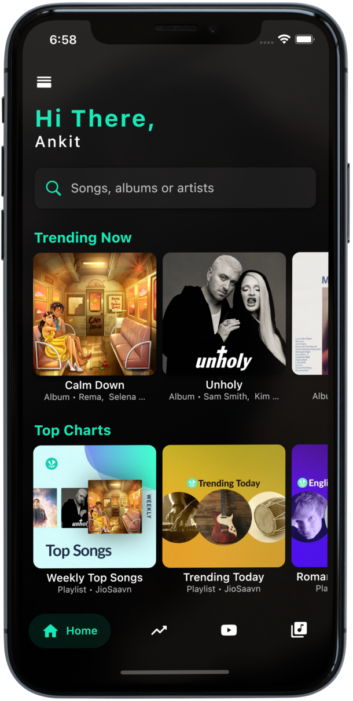
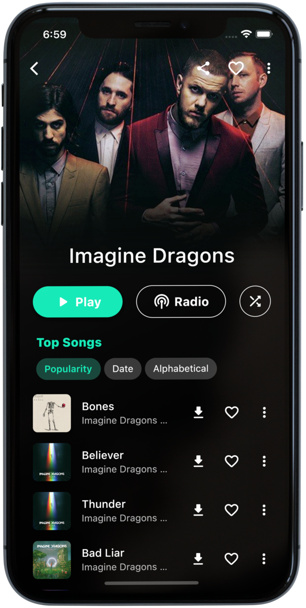
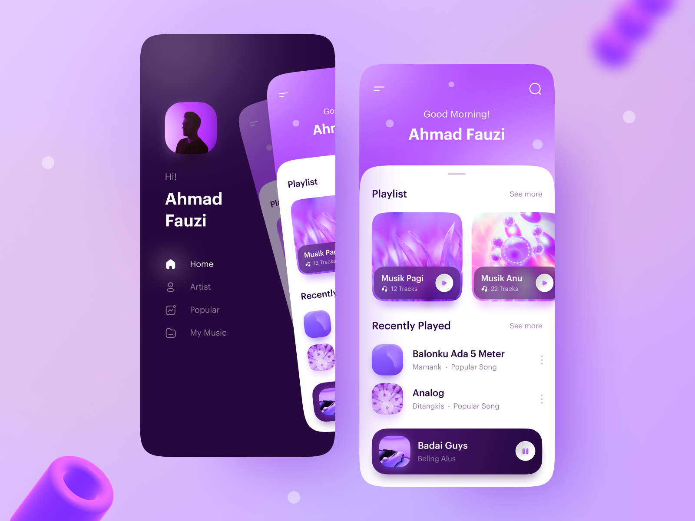
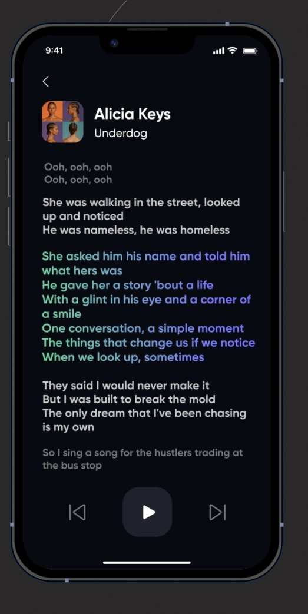
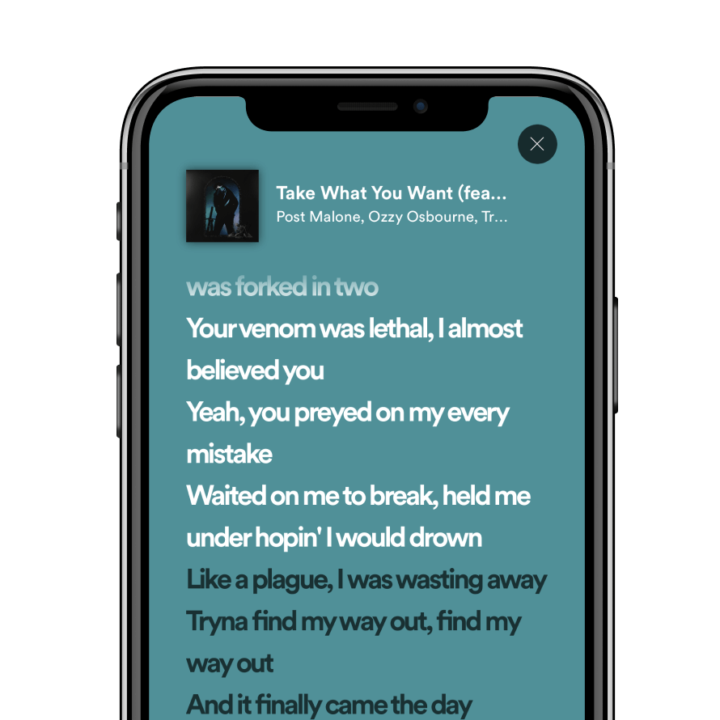

# Benchmark:

## References:

### Black Hole - Cross platfrom music player with Flutter:
https://flutterawesome.com/music-player-frontend-built-with-flutter/

=> Captures d'écran:
- Page d'accueil:

- Page chansons:

### Musikin Aja - Music Player App:
https://dribbble.com/shots/17219469-Musikin-Aja-Music-Player-App

=> Capture d'écran:
- Page d'accueil:

### Muzira music application:
https://dribbble.com/shots/17988274-Muzira-music-application

=> Capture d'écran:
- Page Main détails présentation des paroles:

### Spotify:
https://dribbble.com/shots/17988274-Muzira-music-application

=> Capture d'écran:
- Page Main détails présentation des paroles:
